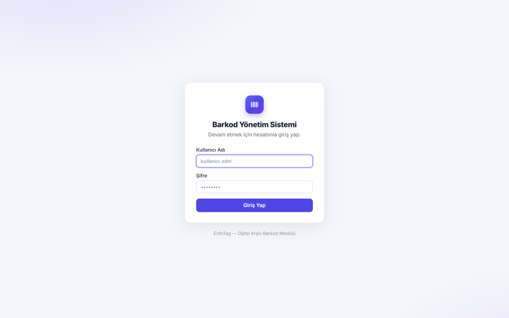
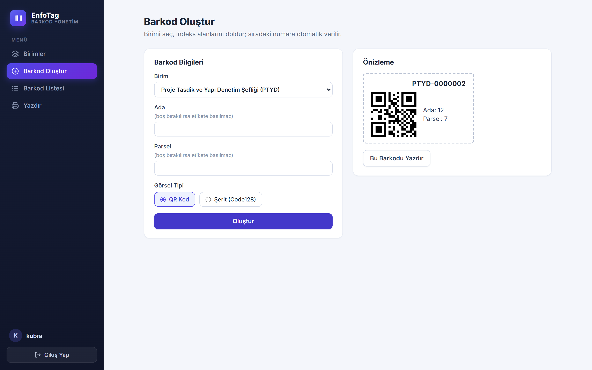
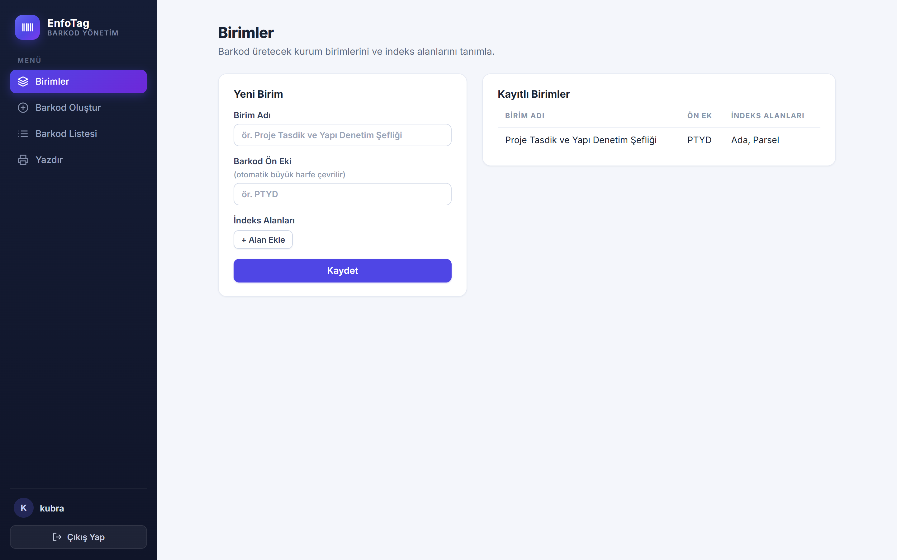
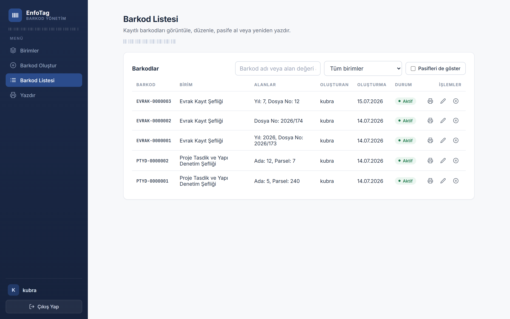
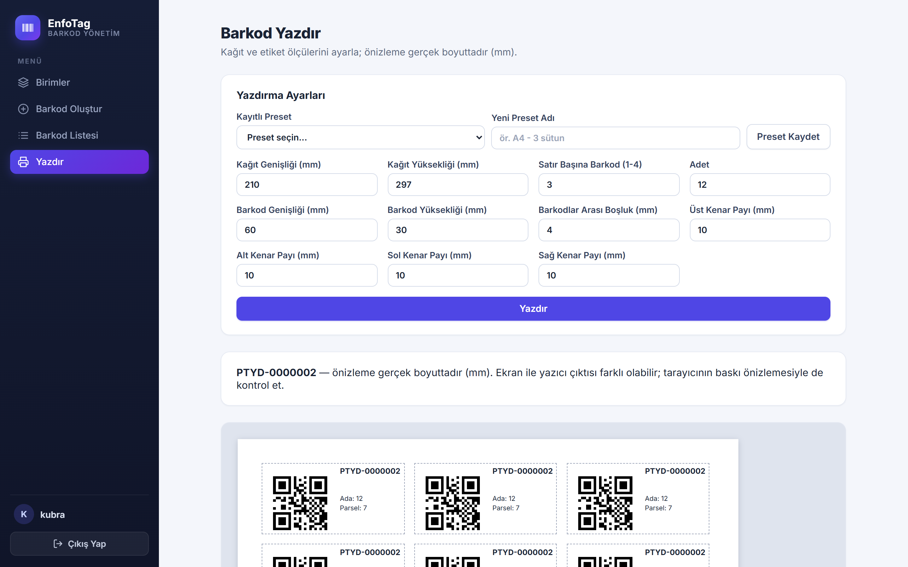

# EnfoTag — Barkod Yönetim Sistemi

Kurum birimlerine özel barkod (`PREFIX-0000001`) üretip QR veya Code128 şerit olarak
görselleştiren, ayarlanabilir etiket düzeniyle yazdıran tam yığın (Django + React) bir
arşiv barkod modülü. Detaylı iş kuralları ve mimari kararlar için [CLAUDE.md](CLAUDE.md)'ye bakın.

## Ekran Görüntüleri

| Giriş | Barkod Oluşturma |
|---|---|
|  |  |
| **Birimler** | **Barkod Listesi** |
|  |  |

**Yazdırma ekranı** — mm bazlı gerçek boyut önizleme, preset yönetimi ve `@media print` ile
yalnızca etiketlerin bastırılması:



## Teknoloji Yığını

- **Backend:** Django + Django REST Framework, JWT (simplejwt), django-cors-headers
- **Veritabanı:** PostgreSQL (Docker) / SQLite (yerel geliştirme)
- **Frontend:** React + Vite, axios, react-router-dom
- **Barkod çizimi:** jsbarcode (Code128) + qrcode.react (QR)

## Dizin Yapısı

```
/backend
  /core          # Django project (settings, urls)
  /barcodes      # modeller, serializer'lar, view'lar, servis fonksiyonları, testler
  Dockerfile
/frontend
  /src
    /pages       # Login, Units, BarcodeCreate, BarcodePrint, BarcodeList
    /components  # Layout, ProtectedRoute, BarcodePreview, BrandMark
    /api         # axios instance + endpoint fonksiyonları
  Dockerfile
docker-compose.yml
```

## Çalıştırma — Docker (önerilen)

Tek komutla PostgreSQL + Django + React'i ayağa kaldırır:

```bash
docker compose up --build
```

- Backend: http://localhost:8000 (migration'lar konteyner açılışında otomatik uygulanır)
- Frontend: http://localhost:5173
- PostgreSQL: localhost:5432 (db: `barkod`, kullanıcı: `barkod`, şifre: `barkod`)

İlk çalıştırmada superuser oluşturmak için (backend ayaktayken, başka bir terminalde):

```bash
docker compose exec backend python manage.py createsuperuser
```

Durdurmak için `Ctrl+C`, ardından `docker compose down` (veritabanını da silmek isterseniz `docker compose down -v`).

### Veritabanını tarayıcıdan görüntüleme (Adminer)

Geliştirme kolaylığı için stack'e [Adminer](https://www.adminer.org/) eklendi — masaüstü bir
istemci kurmadan, tarayıcıdan veritabanına bakabilirsiniz:

- http://localhost:8080 → System: `PostgreSQL`, Server: `db`, Username: `barkod`,
  Password: `barkod`, Database: `barkod`

Uygulamanın bir parçası değildir, sadece geliştirici aracıdır.

## Çalıştırma — Yerel Geliştirme (Docker'sız)

Backend ve frontend'i ayrı terminallerde, SQLite ile çalıştırır (`POSTGRES_DB` ortam
değişkeni tanımlı değilse `settings.py` otomatik SQLite'a düşer):

```bash
# Backend
cd backend
python -m venv venv && venv\Scripts\activate      # Linux/Mac: source venv/bin/activate
pip install -r requirements.txt
python manage.py migrate
python manage.py createsuperuser
python manage.py runserver

# Frontend (yeni terminal)
cd frontend
npm install
npm run dev
```

## Testler

```bash
cd backend
venv\Scripts\python.exe manage.py test barcodes
```

Barkod numarası üretimi (çakışmasız artırma) ve API uçlarının tamamını (auth,
soft delete, `include_inactive` filtresi, alan doğrulama) kapsayan birim testleri.

## API Endpoint'leri

```
POST  /api/token/            → login (username, password) → access + refresh
POST  /api/token/refresh/    → token yenileme
GET   /api/units/            → birim listesi
POST  /api/units/            → birim oluştur {name, barcode_prefix, fields}
GET   /api/units/{id}/       → tek birim (fields listesi barkod ekranı için)
GET   /api/barcodes/         → aktif barkodlar (?include_inactive=true opsiyonel)
POST  /api/barcodes/         → {unit_id, field_values} → barkod üret, name döndür
PATCH /api/barcodes/{id}/    → güncelleme VE pasife alma ({"is_active": false})
GET   /api/presets/          → preset listesi
POST  /api/presets/          → preset kaydet
```

Tüm endpoint'ler `Authorization: Bearer <access_token>` başlığı gerektirir (login/refresh hariç).

## Ekranlar

1. **Giriş** — JWT al/sakla, axios interceptor her isteğe otomatik ekler, token
   süresi dolunca refresh token ile sessizce yeniler.
2. **Birimler** — ad, barkod ön eki (otomatik büyük harf), dinamik indeks alanı listesi.
3. **Barkod Oluştur** — birim seçilince alanları dinamik form olarak render eder,
   üretilen barkodu QR veya şerit olarak çizer (tercih `localStorage`'da saklanır).
4. **Barkod Yazdır** — kağıt/etiket boyutu, satır başına adet, boşluk ve kenar payı
   ayarlarıyla mm bazlı CSS Grid önizleme + `window.print()`; ayarlar preset olarak
   backend'e kaydedilip tekrar seçilebilir.
5. **Barkod Listesi** — düzenleme, pasife alma/aktifleştirme (gerçek silme yok),
   herhangi bir barkodu seçip yeniden yazdırma ekranına gönderme.

## Bilinen Kısıtlar

- Docker'daki frontend geliştirme sunucusuyla (Vite dev server) çalışır; production
  build/nginx ile servis etme bu aşamada kapsam dışı.
- `SECRET_KEY` ve Postgres şifresi demo amaçlı `docker-compose.yml` içinde açık —
  gerçek bir dağıtımda ortam değişkeni/secret yönetimiyle değiştirilmelidir.
